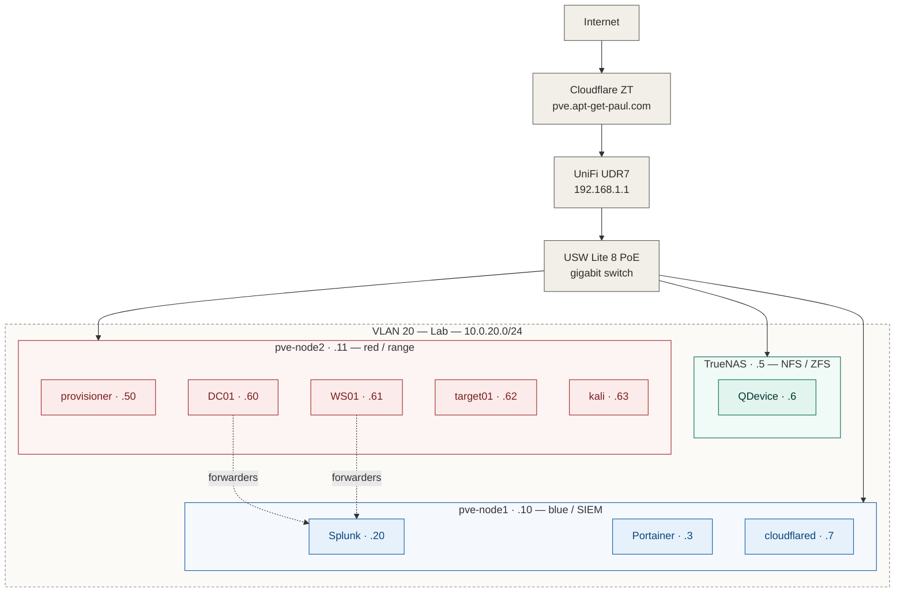

# My Homelab

Here's the repo for my cybersecurity and cloud-focused homelab. This is the central repo that documents the infrastructure and individual projects I have worked on.

I have two proxmox nodes running on mini PC's. One node runs offensive lab environments and the other runs a defensive stack. Everything is built with IaC in mind so it can be easily torn down and rebuilt.

## Architecture

Everything on VLAN 20 (Lab) — 10.0.20.0/24

## Hardware

| Device | Specs | Role |
|---|---|---|
| MINISFORUM AI X1 Pro | Ryzen AI 9 HX 470, 32GB DDR5, 1TB SSD | pve-node1 (blue/infra) |
| Geekom A5 Pro | Ryzen 7 5800H, 32GB DDR4, 512GB SSD | pve-node2 (red/range) |
| UGreen DXP4800 Pro | Intel i3-1315U, 8GB RAM, ZFS | TrueNAS SCALE (NFS storage) |
| UniFi UDR7 | — | Router, VLAN management |
| USW Lite 8 PoE | Gigabit | Switch |

## Projects

Each project has its own repo with detailed docs. Listed in build order.

### [range-as-code](https://github.com/4guilera/range-as-code)
**Status: Operational**

The purple team range — a four-VM Active Directory environment deployed entirely as infrastructure-as-code. Packer builds Windows templates with unattended installs. OpenTofu clones them into a live range. Cloud-init handles the Linux VMs. Next step is Ansible for AD promotion, domain join, and Sysmon deployment.

`Packer` `OpenTofu` `Ansible` `Proxmox` `Windows Server` `Active Directory`

---

### [detection-engineering](https://github.com/4guilera/detection-engineering)
**Status: Operational**

Sigma rules repo with GitHub Actions CI to lint and validate detections on every commit. Rules tested against sample log datasets before they hit the SIEM.

`Sigma` `GitHub Actions` `CI/CD` `YAML`

---

### purple-team-playbook
**Status: planned**

Per-technique writeups following the purple team loop: pick an ATT&CK technique, execute with Atomic Red Team, observe telemetry, write a detection, validate. Each writeup maps back to MITRE ATT&CK with coverage tracking.

`ATT&CK` `Atomic Red Team` `Sigma` `Detection Engineering`

---

## Network

| VLAN | Name | Subnet | Purpose |
|---|---|---|---|
| 1 | Default | 192.168.1.0/24 | Management fallback |
| 10 | Trusted | — | Personal devices |
| 20 | Lab | 10.0.20.0/24 | Proxmox cluster, range, storage |
| 30 | IoT | — | Smart home devices |
| 40 | Guest | — | Guest WiFi |
| 50 | Mgmt | — | Network management |

## Cluster

Two-node Proxmox VE 9.2 cluster with a QDevice quorum tie-breaker running on TrueNAS. Survives a single-node failure. Shared NFS storage for templates, ISOs, and backups.

Admin access is through paul@pve with TOTP 2FA. IaC automation uses a dedicated iac@pve API token with a least-privilege role — no shared credentials.

## What's next

- [ ] Purple team technique writeups
- [ ] Network isolation for range VMs (dedicated bridge)

